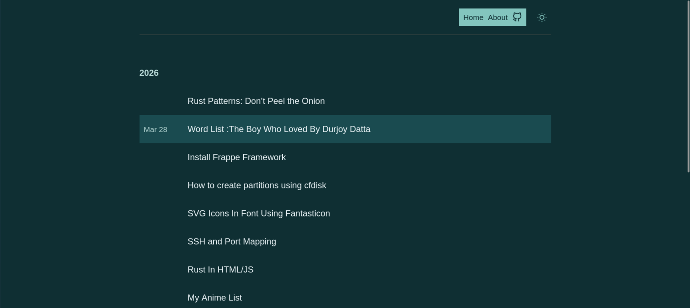

# Spaceboy

A clean, modern Hugo blog theme with dark/light mode, code syntax highlighting, and responsive design.



## Features

### Core
- **Dark/Light Mode** - Toggle between themes with system preference detection and localStorage persistence
- **Responsive Design** - Mobile-friendly layout that adapts to all screen sizes
- **Blog-Ready** - Optimized for blog content with post listings, tags, and categories
- **SEO Optimized** - Built-in meta tags, Open Graph, Twitter Cards, and canonical URLs
- **Back Navigation** - Smart back button that appears on non-home pages

### Content
- **Code Blocks** - Syntax highlighting with one-click copy button and visual feedback
- **Image Gallery** - Grid-based gallery layout with hover zoom effects
- **Image Modal** - Click-to-zoom with pan and scroll support (mouse drag and touch gestures)
- **Lazy Loading** - Optional lazy loading for images on article pages
- **Related Posts** - Automatically displays up to 3 related articles at the end of posts
- **Post Tags** - Tag display with hover effects
- **Post Categories** - Optional category display on home page
- **Home Page Layouts** - Toggle between card grid and list views with persistent preference
- **Card Colors** - 30 unique neutral background colors per card, adapting to light/dark themes
- **Hover Tooltips** - Preview tooltips on post titles showing content snippets

### Customization
- **Navigation** - Customizable menu links via `params.nav`
- **Social Links** - GitHub and other social profiles with SVG icons in header
- **Multi-Language** - Full support for Hugo multilingual sites with language switcher
- **Comments** - Disqus integration with lazy loading
- **Analytics** - Google Analytics support (automatic with Hugo)
- **Custom CSS** - Override and extend styles via extraCSSFiles or asset overrides
- **Custom JavaScript** - Inject extra JS via extraBody parameter
- **Custom Favicon** - Configurable favicon with Apple touch icon support
- **CDN Support** - Static prefix option for CDN hosting
- **Layout Toggle** - Header button to switch between card grid and list views on home page
- **Theme Toggle** - Seamless light/dark mode switching with localStorage persistence

### Technical
- **RSS/Atom Feeds** - Automatic feed generation with alternate link tags
- **Hugo 0.50+** - Compatible with modern Hugo versions
- **No Dependencies** - Vanilla JS, no framework required
- **CSS Minification** - Automatic CSS bundling and minification
- **Content Injection** - Pre/post content injection for posts
- **Mermaid Diagrams** - Built-in support for rendering Mermaid diagrams using shortcodes

## Mermaid Diagrams

The theme includes built-in support for Mermaid diagrams.

**Usage:**
Use the Mermaid shortcode in your Hugo posts:

```markdown

graph TD;
    A[Start] --> B{Is it working?};
    B -- Yes --> C[Great!];
    B -- No --> D[Check documentation];
    D --> B;

```

**Features:**
- Supports all Mermaid diagram types (flowcharts, Gantt, sequence, etc.)
- Automatically adapts to light/dark themes
- Renders on page load
- No additional configuration required

## Installation

### Option 1: Clone Repository

```bash
cd themes
git clone https://github.com/yourusername/spaceboy.git
```

### Option 2: Submodule

```bash
git submodule add https://github.com/yourusername/spaceboy.git themes/spaceboy
```

### Option 3: Hugo Module

```bash
hugo mod init github.com/yourusername/spaceboy
hugo mod get -u
```

## Configuration

Add to your site's `hugo.toml`:

```toml
theme = "spaceboy"

[params]
  # Site metadata
  title = "Your Site Title"
  description = "Your site description"
  author = "Your Name"

  # Required: Author info (displayed in posts)
  [params.author]
    name = "Your Name"

  # Main content sections
  mainSections = ["posts"]

  # Navigation menu
  [[params.nav]]
    name = "Home"
    link = "/"
  [[params.nav]]
    name = "About"
    link = "/about"

  # Social links (displayed in header)
  [[params.socials]]
    name = "GitHub"
    link = "https://github.com/yourusername"
```

### Full Configuration Options

```toml
[params]
  # Required
  title = "Your Site Title"
  description = "Your site description"
  author = "Your Name"
  
  [params.author]
    name = "Your Name"
    # Optional: homepage for author link
    homepage = "https://yourwebsite.com"

  # Content sections (default: ["posts"])
  mainSections = ["posts"]

  # Show categories on home page
  showCategories = true

  # Static files prefix (for CDN)
  staticPrefix = ""

  # Favicon
  favicon = "/favicon.ico"

  # Navigation
  [[params.nav]]
    name = "Home"
    link = "/"
  [[params.nav]]
    name = "About"
    link = "/about"
  [[params.nav]]
    name = "Blog"
    link = "/posts"

  # Social links
  [[params.socials]]
    name = "GitHub"
    link = "https://github.com/yourusername"
  [[params.socials]]
    name = "Twitter"
    link = "https://twitter.com/yourusername"

  # Footer links
  [[params.footerLinks]]
    name = "RSS"
    link = "/index.xml"

  # Disqus comments (set your shortname)
  disqus = "your-disqus-shortname"

  # Lazy load images (not on home page)
  lazyImage = true

  # Google Analytics (automatic with Hugo)
  googleAnalytics = "UA-XXXXX-X"

  # Twitter Cards
  TwitterCards = true

  # Extra CSS files
  extraCSSFiles = ["css/custom.css"]

  # Custom content (injected before/after posts)
  postHeaderContent = ""  # HTML before post content
  postFooterContent = ""  # HTML after post content
  postAds = ""            # Ad code before comments

  # Extra head/body content
  extraHead = ""  # Additional HTML in <head>
  extraBody = ""  # Additional HTML before </body>
```

## Creating Content

### Blog Post

```markdown
---
title: "My First Post"
date: 2024-01-01
draft: false
author: "Your Name"
tags: ["hugo", "blog"]
categories: ["tech"]
---

Your content here...
```

### Gallery Page

Create `content/gallery/my-album.md`:

```markdown
---
title: "Photo Album"
date: 2024-01-01
type: gallery
album: "/images/album-cover.jpg"
gallery:
  - url: "/images/photo1.jpg"
    name: "Mountain View"
  - url: "/images/photo2.jpg"
    name: "Ocean Sunset"
  - url: "/images/photo3.jpg"
    name: "City Lights"
---
```

## Directory Structure

```
spaceboy/
├── archetypes/
│   └── default.md      # Content archetype
├── assets/
│   └── css/
│       ├── index.css   # Main styles
│       └── override.css # Custom overrides
├── layouts/
│   ├── 404.html        # Not found page
│   ├── _default/
│   │   ├── list.html   # Taxonomy listings
│   │   └── single.html # Post/page layout
│   ├── gallery/
│   │   └── single.html # Gallery layout
│   ├── index.html      # Home page
│   └── partials/
│       ├── disqus.html
│       ├── footer.html
│       ├── head.html
│       ├── header.html
│       ├── icons/      # SVG icons
│       ├── post-list.html
│       ├── related.html
│       ├── scripts.html
│       └── seo.html
├── static/
│   ├── fonts/          # Theme fonts
│   ├── images/         # Static images
│   └── js/             # JavaScript files
├── images/
│   ├── screenshot.png
│   └── tn.png
├── LICENSE.md
├── theme.toml
└── README.md
```

## Customization

### Custom CSS

Create `assets/css/override.css` in your site:

```css
/* Override theme colors */
:root {
  --accent-color: #ff6b6b;
  --accent-hover: #ee5a5a;
}

/* Custom styles */
.my-custom-class {
  padding: 1rem;
}
```

### Extra JavaScript

Add to your `hugo.toml`:

```toml
[params]
  extraBody = '<script src="/js/custom.js"></script>'
```

## Theme Colors

The theme features adaptive neutral color palettes with 30 unique card background variations for visual diversity. Colors automatically adjust between light and dark modes.

### Light Mode
- **Backgrounds**: Soft neutral grays and subtle tinted whites
- **Text**: Dark grays for optimal readability
- **Accents**: Medium grays with teal highlights
- **Cards**: 30 cycling neutral backgrounds with dark text

### Dark Mode
- **Backgrounds**: Deep neutral grays and charcoals
- **Text**: Light grays for contrast
- **Accents**: Light grays with teal highlights
- **Cards**: 30 cycling darker neutral backgrounds with light text

Colors are designed for accessibility and visual harmony across all content.

## Browser Support

- Modern browsers (Chrome, Firefox, Safari, Edge)
- Mobile browsers (iOS Safari, Chrome for Android)
- Touch gestures for image modal navigation

## License

MIT License - See [LICENSE.md](./LICENSE.md) for details.
