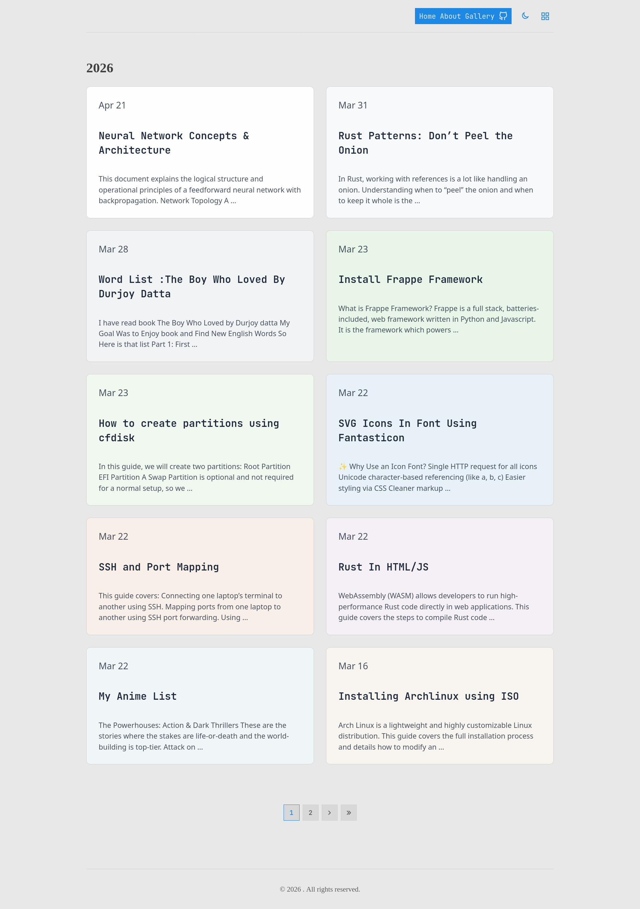
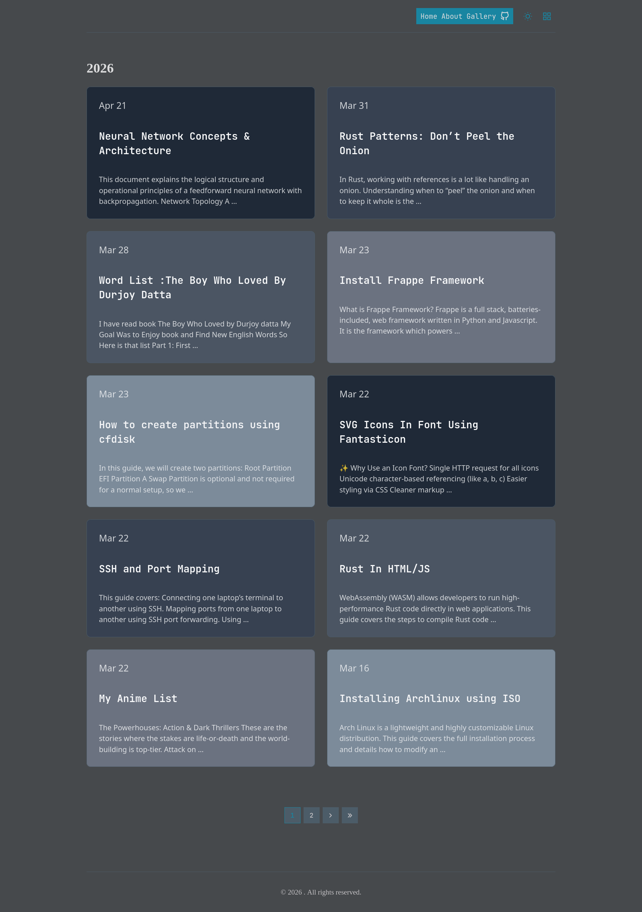
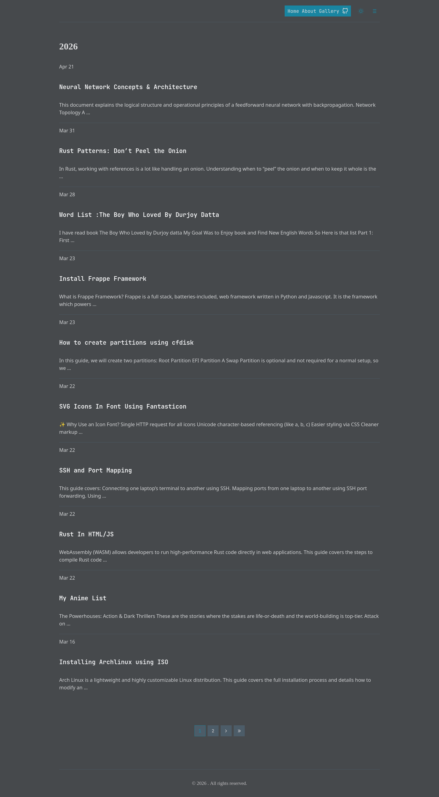

# Spaceboy Hugo Theme

Minimal Hugo blog theme with dark/light mode, 33 color palettes, syntax highlighting, pre-rendered Mermaid diagrams, and pre-rendered KaTeX math.

## Quick Start

```toml
theme = "spaceboy"

[params]
  mainSections = ["posts"]

  [[params.nav]]
    name = "Home"
    link = "/"
  [[params.nav]]
    name = "About"
    link = "/about"
```

## Configuration

```toml
[params]
  mainSections = ["posts"]
  enableCopyCode = true
  lazyImage = true
  favicon = "/favicon.ico"
```

## Content

### Post Frontmatter

```yaml
---
title: "Post Title"
date: 2024-01-01
draft: false
tags: ["tag1"]
categories: ["Tech"]
---
```

### Gallery Page

```yaml
---
title: "Photo Album"
date: 2024-01-01
type: gallery
album: "/images/cover.jpg"
gallery:
  - url: "/images/photo1.jpg"
    name: "Caption"
---
```

### Table of Contents

```yaml
showToc: true
```

## Diagrams (Mermaid)

Diagrams are **pre-rendered to SVGs at build time** — no browser-side JS required.
SVGs use CSS variables so they adapt to the active color palette automatically.

### Fenced code block

~~~markdown

```mermaid
graph TD;
    A --> B;
```
~~~

### Shortcode

```markdown

graph TD;
    A --> B;

```

### Build setup

```bash
cd themes/spaceboy && npm install   # installs @mermaid-js/mermaid-cli
node scripts/render-mermaid-cache.mjs  # renders SVGs into site/static/mermaid-cache/
```

Or from the site root: `npm run build:diagrams`

Rendered SVGs and `data/mermaid-manifest.json` should be committed to git so
any host running plain `hugo` can serve diagrams without the build scripts.

## Math (KaTeX)

Math is **pre-rendered to HTML at build time** — no KaTeX JS required at runtime.
KaTeX CSS is still needed for the rendered output.

Enable goldmark passthrough in `hugo.toml`:

```toml
[markup.goldmark.extensions.passthrough]
  enable = true
  [markup.goldmark.extensions.passthrough.delimiters]
    block = [["$$", "$$"]]
    inline = [["$", "$"]]
```

### Inline math

```markdown
The sigmoid function $f(x) = \frac{1}{1 + e^{-x}}$ maps any value to (0, 1).
```

### Display math

```markdown
$$
f(x) = \frac{1}{1 + e^{-x}}
$$
```

### Build setup

```bash
node scripts/render-katex-cache.mjs  # renders expressions into site/data/katex-cache.json
```

Or from the site root: `npm run build:diagrams`

`data/katex-cache.json` should be committed to git.

**Detection heuristic:** inline `$...$` is only treated as math if the content
contains a LaTeX command (`\frac`, `\sum`, `\times`, etc.) or `^`/`_`. This
avoids false positives from JavaScript `$('selector')` patterns.

## Color Palettes

33 palettes are defined in `data/color-schemes.yaml`. Switch palettes at runtime
via the palette overlay in the UI. Each palette has 6 fields:

```yaml
PaletteName:
  light: '--bg-color:#fff;...'
  dark: '--bg-color:#111;...'
  syntax-light: '--syn-bg:#fff;--syn-keyword:#d73a49;...'
  syntax-dark: '--syn-bg:#282a36;--syn-keyword:#ff79c6;...'
  mermaid-light: '--link-color:#0070f3;...'   # empty string = use defaults
  mermaid-dark: '--link-color:#ff79c6;...'
```

To add or modify a palette, edit `data/color-schemes.yaml` only — this is the
single source of truth. Changes take effect on the next Hugo build with no
template changes required.

## Syntax Highlighting

Token colors use CSS variables (`--syn-*`) so they adapt to the active palette.

```toml
[markup.highlight]
  style = "tokyonight-moon"   # base style (overridden by --syn-* vars at runtime)
  noClasses = false
```

## Custom CSS

Create `assets/css/override.css` in your site:

```css
:root {
  --link-color: #ff6b6b;
}
```

## Hugo Version Compatibility

The theme requires Hugo **0.132+** (for goldmark passthrough extension and `render-passthrough.html`).

**Important for templates:** use `site.Data`, not `hugo.Data`. The `hugo.Data`
API was added in Hugo 0.156 and breaks on older Hugo versions (e.g. Cloudflare
Pages ships 0.147). `site.Data` works on all supported versions.

## Screenshots



---



---



---


